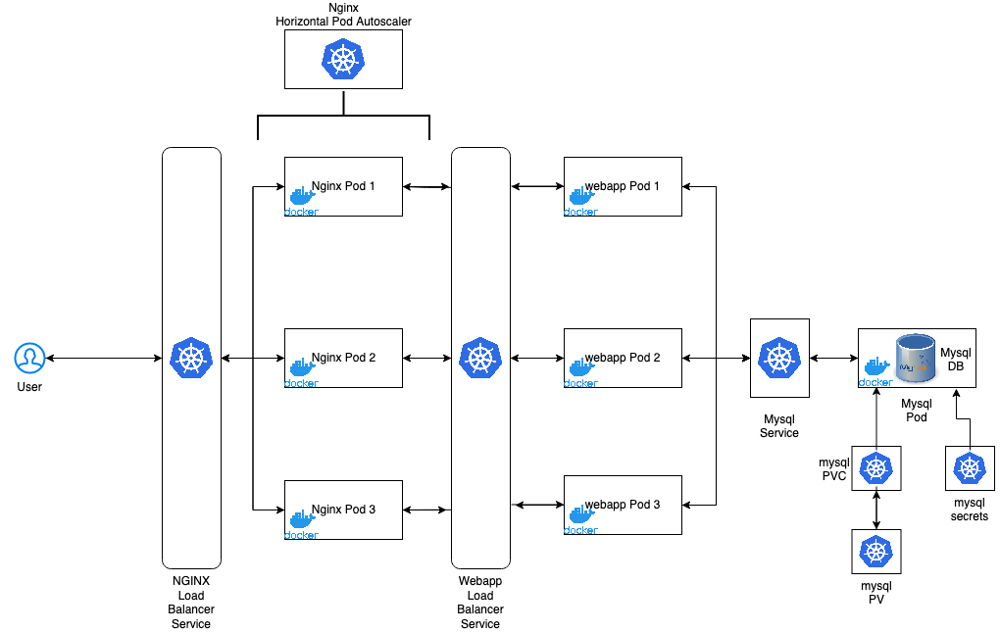
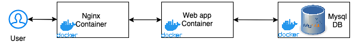

# Malware URL lookup
This application looks up a specified url/path in the database and replies if the url is safe to navigate or not.

The application can be run either on docker through docker-compose or on Kubernetes+Docker with kubectl.

### Extensions:

- Web Framework: [Flask](https://flask.palletsprojects.com/en/2.1.x/)
- SQL ORM: [SQLAlchemy](https://www.sqlalchemy.org/)
- Test Framework: [Pytest](https://docs.pytest.org/en/7.1.x/)
- Database: [MySQL-server](https://www.mysql.com/)
- WSGI: [Gunicorn](https://gunicorn.org/)
- Reverse Proxy server: [Nginx](https://www.nginx.com/)
- Container Engine: [Docker](https://www.docker.com/)
- Contaier Orchestration: [Kubernetes](https://kubernetes.io/)

## Installation

- Clone the git repo:
```
git clone git@github.com:sumitmcc/url-lookup.git  
```

## Getting Started

- ### Run through Docker-compose

Make sure you have Docker installed and running. Navigate to the application folder.

To start the application:
```
make compose
```

The application can be accessed at http://127.0.0.1:8080

To stop the application:
```
make compose-down
```

- ### Run through kubernetes - Minikube
Install [Minikube](https://minikube.sigs.k8s.io/docs/start/) and start minikube with
`minikube start`

Start the application with 
```
make deploy
```

Start Minikube tunnels to expose the ports to host system
```
minikube tunnels
```

Stop the application:
```
make clean
```

Stop minikube with `minikube stop`

## Usage

- ### Look-up for malware

Send a GET request to the route `/api/1/{host-and-port}/{path-and-query}`

A successful response will be with the information for url and status code `200`  

Example:
```python
curl -X GET http://127.0.0.1:8080/api/1/malware.com/ismal\?host\=true

> {"data": {"url": "http://malware.com/ismal?host=true"}, "is_safe": true}

curl -X GET http://127.0.0.1:8080/api/1/hijacker.malware/newpath\?host\=attack

> {"data": {"url": "Forbidden"}, "is_safe": false}
```

- ### Create an entry in database for a malware url

Send a POST request to the route `/api/1/add` with the header `Content-Type`: `application/json`

Body of the post request must contain the url to be added in the following format
```python
{
	"url": "<URL-TO-ADD>"
}
```
A successful response will reply with status code `201` if the entry is newly created or with `200` if the url already existed in the database
Example:
```python
curl --header "Content-Type: application/json" --data '{"url": "newmalware.com:2000/attackpath"}' -X POST http://127.0.0.1:8080/api/1/add

> {"data": {"url": "Forbidden"}, "is_safe": false}
```

- ### Add multiple urls to malware database

Send a POST request to the route `/api/1/createmany` with the header `Content-Type`: `application/json`

The body of the post request must contain the url to be added in the following format

```python
{"malware_list": ["url1","url2","url3",...]}
```
A successful response will reply with data for only the newly created entries with status code of `201`

Example:
```python
url --header "Content-Type: application/json" \
--data '{"malware_list": ["malware2:1772/","malware3:2342/nopath","malware4.com:56643/checkhost?newpath=xaas"]}' \
 -X POST http://127.0.0.1:8080/api/1/createmany

> {
  "data": [
    {
      "url": "malware2:1772/"
    },
    {
      "url": "malware3:2342/nopath"
    },
    {
      "url": "malware4.com:56643/checkhost?newpath=xaas"
    }
  ]
}
```

- ### Delete a url from Database

Send a DELETE request to the route `/api/1/delete` with the header `Content-Type`: `application/json`

The body of the delete request must contain the url to be added in the following format

```python
{"url": "<url-to-be-deleted>"}
```
A successful response will reply with url marked safe with status code of `200`

Example:
```python
curl --header "Content-Type: application/json" --data '{"url": "malware2:1772/"}' -X DELETE http://127.0.0.1:8080/api/1/delete

> {"data": {"url": "http://malware2:1772/"}, "is_safe": true}
```

## Running Tests

### When using docker-compose

- Run `docker ps` to list the running containers and make sure the flask_app container is running
- execute bash command on the application container flask_app:
```dockerfile
docker exec -it flask_app bash
```
- Once inside the container, start the tests with `pytest tests`
```python
root@9482f1b15072:/# pytest tests
============================================================================================================================= test session starts ==============================================================================================================================
platform linux -- Python 3.10.5, pytest-7.1.2, pluggy-1.0.0
rootdir: /tests
collected 20 items

tests/test_create.py ...                                                                                                                                                                                                                                                 [ 15%]
tests/test_data_format.py ........                                                                                                                                                                                                                                       [ 55%]
tests/test_delete.py .                                                                                                                                                                                                                                                   [ 60%]
tests/test_malware.py ........                                                                                                                                                                                                                                           [100%]


======================================================================================================================== 20 passed, 1 warning in 0.28s =========================================================================================================================
```
- run `exit` to exit out of container

### When using kubernetes deployment

- Run `kubectl get pods` to get the active pods
```text
➜  flaskProject: kubectl get pods
NAME                     READY   STATUS    RESTARTS      AGE
mysql-658b87fbbb-8vcr5   1/1     Running   0             38s
nginx-5d75d75566-8jpxt   1/1     Running   0             18s
nginx-5d75d75566-fpfcl   1/1     Running   0             18s
nginx-5d75d75566-tsd9h   1/1     Running   0             18s
web-77f74dfdc8-4d6fq     1/1     Running   0             32s
web-77f74dfdc8-6vrq8     1/1     Running   0             32s
web-77f74dfdc8-dgtl2     1/1     Running   0             32s
```

- login into a web pod by running command `kubectl exec -it <pod-name> bash`

```text
➜  flaskProject k exec -it web-77f74dfdc8-4d6fq -- bash
root@web-77f74dfdc8-4d6fq:/#
```

- Once inside the pod, run `pytest tests` to start the tests

```python
root@web-77f74dfdc8-4d6fq:/# pytest tests
============================================================================================================================= test session starts ==============================================================================================================================
platform linux -- Python 3.10.5, pytest-7.1.2, pluggy-1.0.0
rootdir: /tests
collected 20 items

tests/test_create.py ...                                                                                                                                                                                                                                                 [ 15%]
tests/test_data_format.py ........                                                                                                                                                                                                                                       [ 55%]
tests/test_delete.py .                                                                                                                                                                                                                                                   [ 60%]
tests/test_malware.py ........                                                                                                                                                                                                                                           [100%]

======================================================================================================================== 20 passed, 1 warning in 0.33s =========================================================================================================================
root@web-77f74dfdc8-4d6fq:/#
```

- run `exit` to exit out of container

## Application architecture

### Kubernetes model



### Docker model


